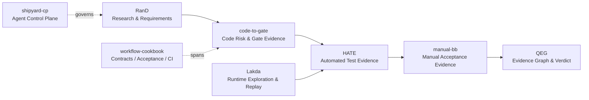

  

<h3 align="center">Autonomous R&amp;D Systems Engineer / Harness Engineer</h3>

  Agent runtimes · Verification harnesses · Control planes · Evidence-driven quality governance

## About

AIに開発・研究を任せても、迷子にならず、壊さず、証拠を残し、必要なら止められるようにする仕組みを作っています。

AIを単なる生成器として扱うのではなく、明示的な契約、状態機械、独立した安全・品質Gate、追跡可能なArtifactを持つ実行系として設計します。QA / SDETを土台に、要求、コード差分、実行時探索、自動・手動テスト、証拠グラフ、最終判断を接続しています。

**AI Conductor** は、モデル、ツール、テスト、Gate、人間の責務を分け、全体を一つの検証可能な実行系として指揮する立場を指す、自分なりの呼称です。

I build governed autonomous R&D systems: the control, verification, and evidence layers that make AI-generated work observable, reproducible, reviewable, and controllable.

## One System, Eight Public Repositories

以下は独立したデモの寄せ集めではなく、要求から品質判断までを接続する一つのシステムとして設計しています。

| Layer | Repository | Responsibility |
|---|---|---|
| Research & Requirements | [RanD](https://github.com/RNA4219/RanD) | Research, hypothesis formation, requirement discovery, and acceptance framing. |
| Workflow Contracts | [workflow-cookbook](https://github.com/RNA4219/workflow-cookbook) | Operational contracts, Task Seeds, acceptance gates, reusable CI, and evidence-oriented development practices. |
| Agent Control Plane | [shipyard-cp](https://github.com/RNA4219/shipyard-cp) | Governed agent execution across planning, development, acceptance, integration, and publishing. |
| Code Risk & Gate | [code-to-gate](https://github.com/RNA4219/code-to-gate) | Converts source changes, static signals, architecture checks, and repository risk into reviewable Gate evidence. |
| Runtime Exploration | [domain-lakda-runner](https://github.com/RNA4219/domain-lakda-runner) | Explores targets as state transitions and produces reproducible, replayable runtime evidence. |
| Automated Test Evidence | [harness-auto-test-evidence](https://github.com/RNA4219/harness-auto-test-evidence) | Normalizes automated test results into versioned, traceable, downstream-consumable evidence. |
| Manual Acceptance | [manual-bb-test-harness](https://github.com/RNA4219/manual-bb-test-harness) | Produces risk-based manual black-box acceptance evidence and Go / No-Go material. |
| Evidence & Decision | [quality-evidence-graph](https://github.com/RNA4219/quality-evidence-graph) | Connects requirements, risks, changes, tests, evidence, and approvals into an evidence-based quality verdict. |

## Current R&D

The public stack above is now being integrated into a **private autonomous R&D runtime**.

生成、独立評価、安全判定、品質判定、実行権限、人間の境界承認を一体化せず、別々のActorとArtifactとして扱うことで、自律性を上げても判断根拠と停止可能性を失わない構造を作っています。

The runtime itself remains private. The public repositories are its reusable control, verification, and evidence layer.

## Engineering Principles

- **Evidence over confidence.** 判断はモデルの自信ではなく、追跡可能な証拠へ接続する。
- **Explicit contracts over implicit coordination.** Schema、状態遷移、責務境界を先に固定する。
- **Fail closed.** 証拠欠損、未知判定、契約不一致は続行ではなくholdへ送る。
- **Independent authority.** 安全、品質、実行権限を一つのAgentへ集約しない。
- **Replayable by design.** 再実行、復旧、冪等性、障害注入を後付けにしない。
- **AI proposes; evidence decides.** AIの生成速度を、検証不能な速度にしない。

## Focus Areas

`Autonomous R&D Systems` · `Agent Runtimes` · `Harness Engineering` · `Control Planes` · `Quality Governance` · `Evidence Graphs` · `Contract-Driven Workflows` · `LLM-native Development`

## Core Stack

- **Languages:** Python, TypeScript / JavaScript, SQL, Bash
- **Contracts & State:** JSON Schema, SQLite, state machines, append-only artifacts, REST / CLI interfaces
- **QA & Verification:** pytest, Playwright, Airtest, Jest / Vitest, coverage, CodeQL, GitHub Actions
- **Runtime & Isolation:** Docker / OCI containers, devcontainers, async workers, local-first infrastructure
- **LLM Systems:** OpenAI-compatible APIs, local LLMs, llama.cpp / Ollama, routing and orchestration tooling
